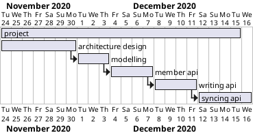

# TIL 2020-11-23

--------------------------

## 할 일

- [x] 수강하기
- [x] 인공지능 내용 정리
- [x] margin 프로젝트 일정 정리

## 인공지능 내용 정리

인공지능 내용이 어떻게 돌아가는지,

인공지능을 통한 소리 상황 인식 모듈은 MobileNet 기반 딥러닝 분류 모델인 Yamnet을 이용하여 개발되었습니다. 스마트폰이나 임베디드 기기에서 동작할 수 있도록 가볍게 설계된 yamnet은 구글의 유튜브 영상으로부터 수집된 AudioSet이라는 소리 데이터셋을 이용하여 학습되었고, 총 521가지의 소리를 분류할 수 있으며, 약 370만 개의 파라미터를 가지고 있습니다. yamnet은 mAP (mean average presi) 평균 예측 정확도 0.306을 가집니다. 이는 한 클래스에 대한 예측 정확도이고, 여러 가지 종류의 소리에 대해 클러스터링을 통해 예측 정확도를 높일 수 있었습니다. 이러한 딥러닝 분류 모델을 이용하여 실시간으로 소리 상황에 대한 정확도를 얻고, 아기 울음소리, 화재 경보소리, 문소리 등 바다가 들어야 하는 소리들로 필터링을 거친 뒤, 해당 소리들 중에 일정 시간 이상 특정 소리가 나는 것으로 판단되면 소리 상황 이벤트에 대한 ros 토픽을 생성합니다.

## margin 프로젝트 일정 정리

margin 필요 기능, 일정 세우기

비대면/모바일
- 경제활동
- 일기 : 소규모 : 로그인/저장
  - 회원관리기능 : 회원가입(이름,나이,비밀번호,이메일,),로그인,로그아웃,정보변경,정보삭제,개인정보처리방침
  - 일기기능 : 일기쓰기, 일기편집, 일기리스트/확인, 태깅, 카테고리, 등..

일정
- 서버 기능:
  - 글 편집, 글 삭제, 글 읽기, 글 목록, 글 검색, 회원가입, 로그인, 동기화, 
  
로그인, 회원가입 절차:
  - 특정 프로세스에서 서버의 공개키로 sign된 토큰으로 랜덤키 발급 요청. 개인 키로 확인하여 정상 요청일 경우 랜덤 키 발행.
  - 랜덤 키를 통해 이후 api 호출
  - 동기화 하면 패스워드 내보내기 방식 고려.

typescript 저장소 초기화하고 실행까지 성공.
vscode에서 디버깅으로 돌리는게 잘 안되었었는데, `cwd`설정을 해주어서 성공함. (ts-node가 tsconfig를 읽으므로 해당 폴더 위치로 설정 필요한듯? 자세히는 모르겠따)

## 강의수강

## tags
- \#TIL, \#blog, \#prj, \#capstone

--------------------------