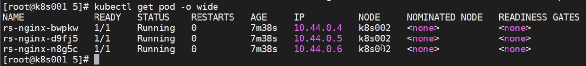

# TIL 2020-12-08

--------------------------

## 할 일

- [x] 알고리즘 문제풀이
- [ ] 지원서 쓰기
- [x] 시험공부
- [x] 쿠버네티스 멘토링

## 알고리즘 문제풀이

### [백준 - 구간 합 구하기](https://www.acmicpc.net/problem/2042)

세그먼트 트리 구현 문제.

<details><summary markdown="span">py solution</summary>

```py
def solve():
    def updateFrom(pos, val):
        # update the seg tree with val and start from this position
        cur = offset+pos
        seg[cur] = val
        cur = cur // 2
        while cur >= 1:
            seg[cur] = seg[cur*2]+seg[cur*2+1]
            cur = cur // 2
        pass

    def getSum(left,right):
        # get sum of range starting from left to right
        sums=0
        left = offset+left
        right = offset+right
        while(left<=right):
            if(left%2==1):
                # left is on right, add to sums
                sums += seg[left]
            left=(left + 1)//2
            if(right%2==0):
                # right is on left, add to sums
                sums += seg[right]
            right=(right - 1)//2
            pass
        return sums
    N,M,K=ria()
    ins = []
    seg = []
    len1 = 1
    for i in range(N):
        ins.append(ria()[0])
    
    it(ins)
    while(len1<len(ins)):
        len1*=2

    seg = [0] * (len(ins)*4)
    offset = len1-1

    # initialize
    for i in range(len(ins)):
        seg[offset+i+1] = ins[i]

    for i in range(offset,0,-1):
        seg[i] = seg[i*2]+seg[i*2+1]

    for j in range(M+K):
        a,b,c = ria()
        if(a==1):
            updateFrom(b,c)
        else:
            print(getSum(b,c))
```

</details>


## SRE 관련

네이버에서 devops/sre 관련 신입을 뽑는다.
그런데 이쪽으로 가면 개발 트랙으로 가기 어렵다는 말도 있다.
어쨌든 관심분야이긴 하다.

https://bcho.tistory.com/1325
deview 2019 sre - https://tv.naver.com/v/11211080

### deview 2019 ncp network virtualization - https://tv.naver.com/v/11210658/list/534045

- server virtualization + tenant isolation
-> overlay network

## 세그먼트 트리


## 쿠버네티스 멘토링

replicaSet이 ReplicationController보다 다양한 기능 지원. Deployment는 ReplicaSet을 관리. Stateless한 앱을 관리하는데 사용. state는 Redis 등을 써서 처리.

### kube 5. K8s Services


- flannel
- calico
  -     

`kubectl get pod -n kube-system`

`kubectl exec -n kube-system weave-net-9zbcw -c weave -- /home/weave/weave --local status`

#### k8s Endpoints

`kubectl get endpoints`

각 pod에 대한 endpoint 관리
서비스가 endpoint를 가리킨다. 그러나 selector로 가리키므로 자유롭게 뗄 수도 있다.
서비스의 노출 방법:
1. clusterIp
2. nodePort
3. loadBalancer

k8s service network 특징:
1. proxy 서버 스스로 내구성, 장애 대응 가능
2. 트래픽을 전달할 pod의 endpoint 리스트를 가지고 있어야 한다.
3. pod들이 정상적으로 동작하는지 확인할 수 있어야 한다.

서비스 확인:
`kubectl get svc`

nat 테이블 확인:
`iptables -t nat -S | grep 80`

iptables로 서비스가 어디를 향하는지 확인 가능.

  

최종 목적지:

  


서비스의 기본 type은 clusterIP

- kube-proxy를 통한 backend iptables rule 생성


이렇게도 배포 가능:
`kubectl create deployment webserver --image=nginx:latest`


`kubectl expose deployment webserver --type=ClusterIP --port=80`

### Session Affirnity

사용자가 특정 pod로 접속했을 때, 다음 접속에서 다른 pod로 가지 않도록 하게 함.

type:
- ClientIP
- None


기본 3시간

### NodePort

모든 노드에서 열림.


## tags
- \#TIL, \#blog, \#prj, \#algorithm, \#sport

--------------------------