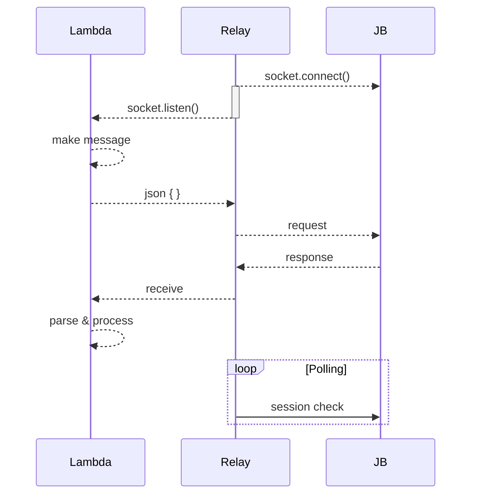

# log 2022-02-16

---

- [blog](#blog)
- [job](#job)
  - [GOP-14151 작업 17 - 프로토콜 구현](#gop-14151-작업-17---프로토콜-구현)
- [study](#study)
  - [clean architecture 공부](#clean-architecture-공부)
- [tags](#tags)

## blog

오 나이스 live share에서 호스트가 게스트를 따라오게 하면 마크다운 toc 업데이트가 잘 작동한다. 왜 이게 되는거지? 두번 저장되어서 가능한걸지도. 맞는 느낌이다. 목차 추가해서 저장하면 그 다음 toc 바뀌면서 다시 수정 상태로 바뀌고, 한 번 더 저장해야 한다.

## job

야 생각해보니 이제 기사 났으니까 내가 무슨 작업하는지 다 써도 되겠네? ㄱㅇㄷ

### GOP-14151 작업 17 - 프로토콜 구현

서버 내에 한 층 더 작업해서 래핑하는 방식은, 릴레이 서버의 복잡도를 너무 증가시킬 듯 하다.
릴레이 서버는 폴링 및 릴레이만 담당하고, 람다가 프로토콜 처리를 하도록 한다.

- 연동서버 송신부 포함 릴레이 구조 구현 및 테스트
- 테스트콜 부터 프로토콜 테스트 예정
- 마크님 리뷰

재전달 등 구조확인

루트? 아이노드?? 그런 문제로 노드 서버가 문제가 있었다는데 (데일리에서), 모르는 것이 많다..

ecs 즉 도커 패키징해서 올리면 stdout이 cloudwatch로 자동 연동된다고 한다.
패키징 어떻게 하나?

각각이 대답 없는 경우, 끊어지는 경우 등을 처리할 필요 있음.
relay->jb 대답 없고 끊어진 경우: 에러 메시지 로그 및 주기적으로 재연결 시도
lambda->relay : 에러 메시지 로그

올리려다 보니, 받는 port는 또 달라서, 소켓 두개 만들어서 통신. 멀티스레드 클라이언트 테스팅 완료. 이중화 하려면.. 보내는 릴레이 서버 받는 릴레이 서버 따로 해야하려나..?

할것:
- 도커 패키징 알아보기
- 프로토콜 구현하기
- 인스턴스에서 테스트하기

확인:
- 소켓 레이어 레벨? 지정하는게 있던데 그것도 확인하기.
근데 소켓 관련해서 옵션이 하도 많아서 다 알기가 어렵다.

## study

### clean architecture 공부

SOLID원칙의 SRP, OCP 학습.

SRP: 한 액터가 한 변경의 이유를 담당
OCP: 변경에 닫히고, 확장에 열리도록 클래스 설계

## tags

- blog
- socket
- study
- aws
- architecture

---
